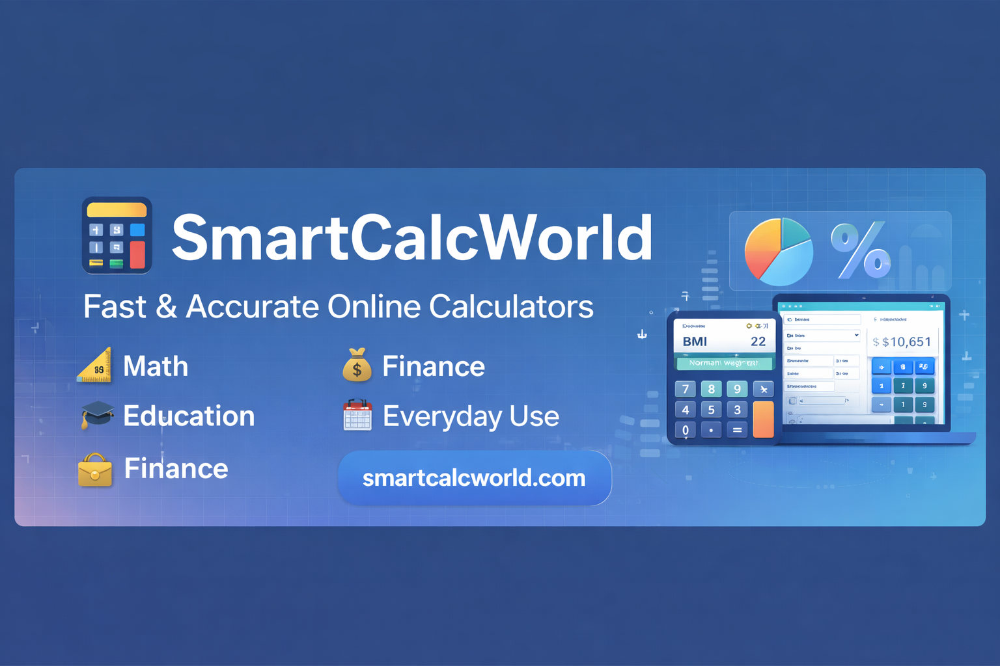

  

<h1 align="center">🧮 SmartCalcWorld</h1>

  Fast & Accurate Online Calculators for Students, Finance, and Everyday Use

  
  
  

  

---

## 🌐 Live Website

https://smartcalcworld.com

---

## 🚀 About SmartCalcWorld

**SmartCalcWorld** is a collection of fast, accurate, and easy-to-use online calculators designed to help students, professionals, and everyday users perform calculations quickly.

The platform focuses on:

* ⚡ Fast performance
* 📱 Mobile-friendly design
* 🎓 Tools for students and education
* 💰 Finance calculators
* 📊 Accurate mathematical formulas

---

## 📊 Calculator Categories

SmartCalcWorld includes calculators for:

* 📐 Math Calculators
* 💰 Finance Calculators
* 🎓 Student Tools
* 📅 Date & Time Calculators
* 📈 Percentage & Statistics Tools

New calculators are continuously added to expand the platform.

---

## 🛠 Technologies Used

This project is built using:

* **HTML**
* **CSS**
* **JavaScript**

These technologies ensure fast performance and compatibility across modern browsers.

---

## 💡 Example Calculators

Some tools available on SmartCalcWorld include:

* Age Calculator
* Percentage Calculator
* BMI Calculator
* EMI Calculator
* Unit Converter

More calculators will be added regularly.

---

## 📢 Suggestions & Ideas

If you have an idea for a useful calculator, feel free to:

* Open an **Issue**
* Start a **Discussion**

Your suggestions help improve SmartCalcWorld.

---

## ⭐ Support the Project

If you find SmartCalcWorld helpful, consider giving this repository a **star ⭐**.

It helps the project reach more people.

---

## 📜 License

This project is available for educational and learning purposes.
